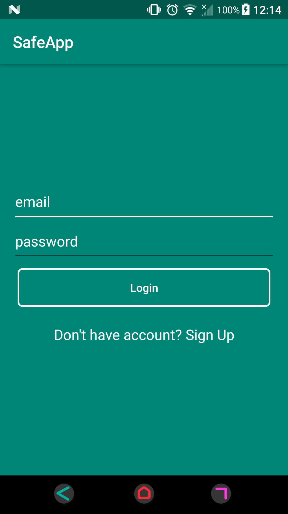
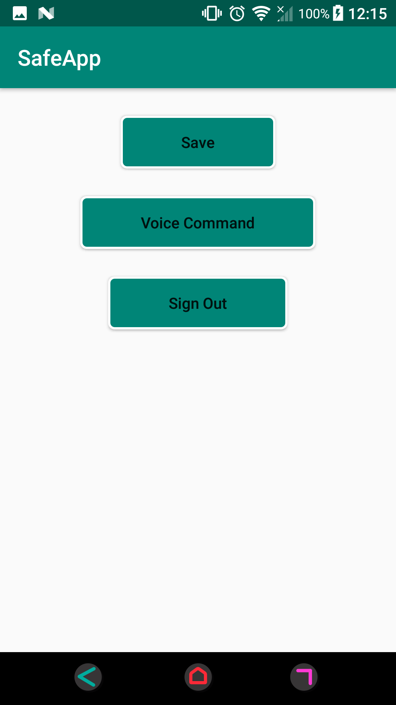
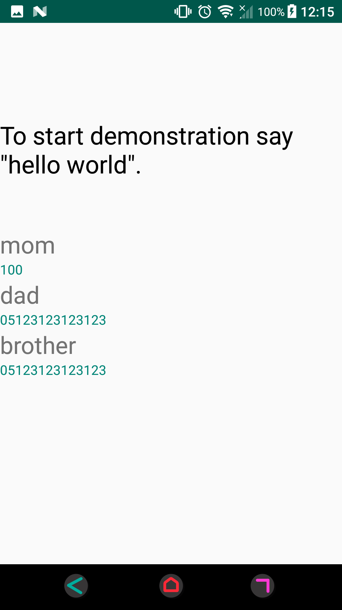
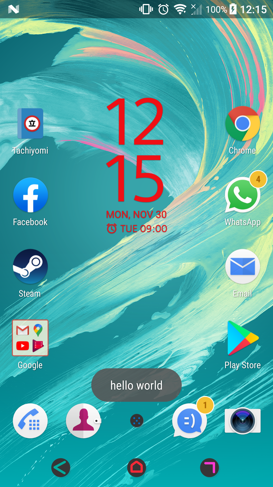
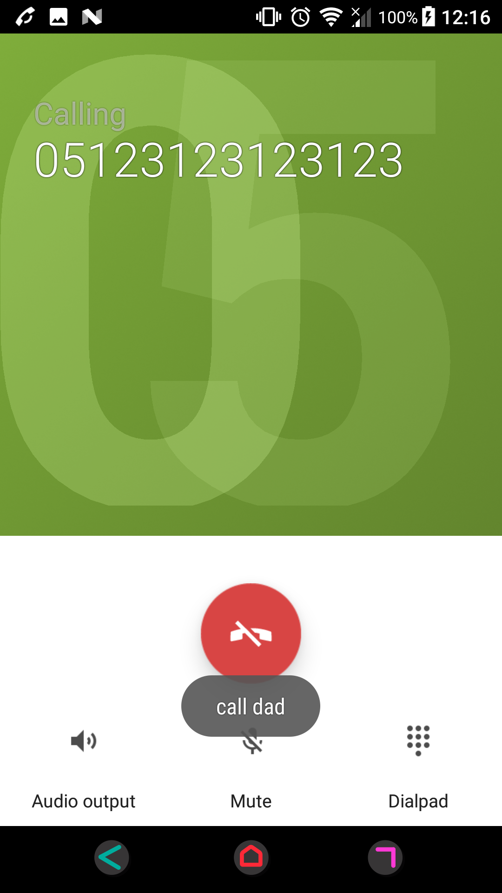

# SafeApp

This is an application doing continuous voice recognition as a background service.

## Authentication

You can sign up to application and log in.

## Profile Page

You can directly go to Voice Command Page or change profile.

## Voice Commands

Voice page shows who can called with voice commands. 

While in background, "hello world" command start the understaning process. 

When the user says "call ...", the application will automatically calls the person being said.

## Resources

- Android Studio
- CMU Sphnix 
- Firebase

